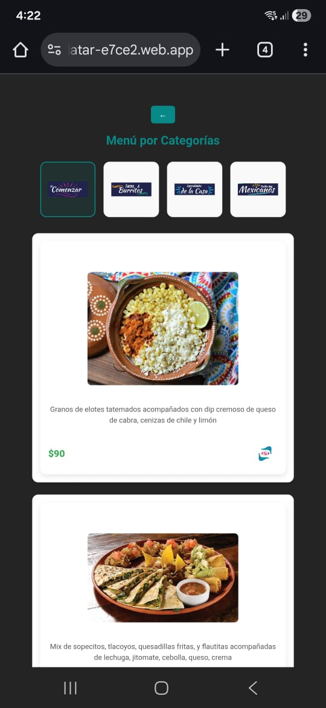

# PlatAR-AR-Menu
Augmented Reality (AR) interactive restaurant menu built with WebAR and deployed on Firebase Hosting.

PlatAR is a web-based interactive menu that uses Augmented Reality (AR) to enhance the restaurant customer experience by allowing users to visualize selected dishes in 3D directly from their mobile devices.

The project was originally developed during a university hackathon, where it achieved **2nd place**, and is currently being extended as a personal project.

---

## 🚀 Project Overview

PlatAR aims to improve customer engagement and decision-making in restaurants by combining a simple, intuitive interface with AR visualization.  
The application is accessible directly from mobile browsers (iOS and Android) without requiring users to install a native app.

---

## 🛠️ Technologies Used

- HTML, CSS, JavaScript  
- WebAR / WebXR  
- Tailwind CSS  
- Firebase Hosting  
- Responsive design for mobile devices  

---

## 🌐 Deployment

The project is deployed using **Firebase Hosting**, enabling fast and reliable access from mobile devices.

🔗 *Live demo:*  
https://platar-e7ce2.web.app/ 

---

## 👥 Role and Responsibilities

- Team leader during the hackathon
- Coordinated tasks, scope, and delivery under time constraints
- Designed and implemented core UI and AR interactions
- Focused on usability, performance, and scalability

---

## 🏆 Achievements

- **2nd place – University Hackathon**
- Positive feedback for innovation, usability, and technical execution

---

## 📌 Current Status

PlatAR is currently a prototype under active development. Planned improvements include:
- implementation of AR
- Internationalization (i18n)
- Enhanced 3D models and AR animations
- Backend integration for dynamic menu management

---

## 📷 Screenshots / Demo

---

## 🇲🇽 Descripción en Español

PlatAR es un menú interactivo con realidad aumentada diseñado para mejorar la experiencia del cliente en restaurantes, permitiendo visualizar platillos en 3D desde dispositivos móviles.

El proyecto obtuvo **segundo lugar en un hackatón universitario** y actualmente continúa en desarrollo como proyecto personal.
